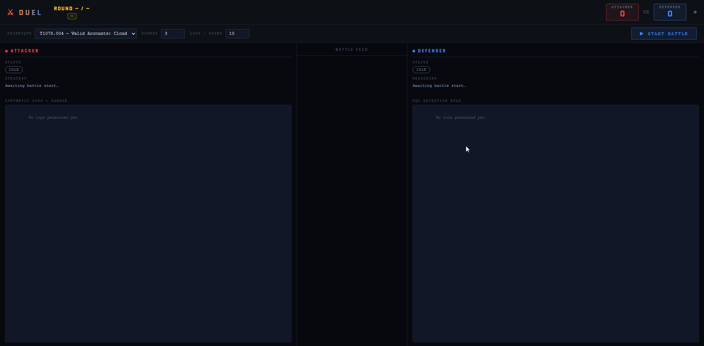

# DUEL — Dual Unsupervised Evasion Loop

> An adversarial LLM framework where an Attacker and a Defender battle across
> multiple rounds over synthetic Microsoft Sentinel telemetry — no cloud APIs,
> no external data, no human in the loop.


[](https://github.com/0xDanielSec/duel-framework/actions/workflows/weekly-duel.yml)



<!-- weekly-badge-start -->
*No weekly battle run yet — trigger the workflow manually or wait for Monday 08:00 UTC.*
<!-- weekly-badge-end -->

---

## What is DUEL?

DUEL is a self-contained adversarial security research framework. Two locally
running LLM agents are pitted against each other over a configurable number of
rounds. The **Attacker** (`llama3.1:8b`) is given a MITRE ATT&CK technique
definition and tasked with generating synthetic telemetry that looks like real
Azure AD / Microsoft 365 attack activity — credential abuse, password spraying,
OAuth token theft — while actively reasoning about what the Defender detected
last round and mutating its approach to evade it. The **Defender** (`mistral:7b`)
reads that same telemetry, studies what slipped through its previous KQL rules,
and rewrites them to close the gaps.

Between each agent turn, DUEL's built-in detection engine executes the Defender's
KQL rule against pandas DataFrames that mirror real Microsoft Sentinel schemas
(`SigninLogs`, `SecurityEvent`, `AuditLogs`). Every row is tagged with a unique
ID so the engine can precisely report which logs were caught and which evaded.
The scorer tracks the game state — attacker points for each evaded log, defender
points for each detection — and feeds the results back into the next round's
prompts, giving both agents genuine memory of the battle history.

After all rounds complete, DUEL generates three output artifacts: a per-round
structured JSON battle log, a final report listing every KQL rule that caught at
least one attack log, and a post-battle analysis (`battle_analysis.md`) that
breaks down exactly how the Attacker mutated, why each Defender rule failed at
the field level, which detection signals were left permanently unaddressed, and
what concrete KQL rules a real Sentinel deployment should add. Everything runs
offline — there are no calls to the Anthropic API, OpenAI, or any other paid
service.

---

## Architecture

```
┌─────────────────────────────────────────────────────────────────────┐
│                         DUEL ADVERSARIAL LOOP                        │
│                                                                       │
│   ┌──────────────────────────────────┐                               │
│   │         TECHNIQUE LIBRARY        │                               │
│   │  techniques/T1078.004.json       │  IOCs · Evasion variants      │
│   │  techniques/T1110.003.json       │  Sentinel tables · KQL hints  │
│   └─────────────────┬────────────────┘                               │
│                     │                                                 │
│          ┌──────────▼──────────┐                                     │
│          │   ATTACKER AGENT    │  llama3.1:8b via Ollama             │
│          │  agents/attacker.py │                                     │
│          │                     │  Round 1: generate initial TTPs     │
│          │  ┌───────────────┐  │  Round N: mutate based on what      │
│          │  │ Mutation logic│  │           was detected last round   │
│          │  └───────────────┘  │                                     │
│          └──────────┬──────────┘                                     │
│                     │  Synthetic log entries (JSON)                   │
│                     │  [{table, _duel_id, IPAddress, UserAgent, …}]  │
│          ┌──────────▼──────────┐                                     │
│          │   DEFENDER AGENT    │  mistral:7b via Ollama              │
│          │  agents/defender.py │                                     │
│          │                     │  Round 1: write initial KQL rule    │
│          │  ┌───────────────┐  │  Round N: harden based on what      │
│          │  │Hardening logic│  │           evaded last round         │
│          │  └───────────────┘  │                                     │
│          └──────────┬──────────┘                                     │
│                     │  KQL detection rule (string)                   │
│          ┌──────────▼──────────┐                                     │
│          │  DETECTION ENGINE   │  engine/detection.py               │
│          │                     │                                     │
│          │  SigninLogs      ◄──┤  KQL → pandas pipeline executor    │
│          │  SecurityEvent   ◄──┤  Mirrors real Sentinel schemas      │
│          │  AuditLogs       ◄──┤  Returns: set of detected _duel_id  │
│          └──────────┬──────────┘                                     │
│                     │  detected_ids: set[str]                        │
│          ┌──────────▼──────────┐                                     │
│          │      SCORER         │  engine/scoring.py                  │
│          │                     │                                     │
│          │  Attacker +1/evaded │  Writes round_NN_battle_log.json    │
│          │  Defender +1/caught │  Feeds results → next round prompt  │
│          └──────────┬──────────┘                                     │
│                     │  (repeat for N rounds)                         │
│          ┌──────────▼──────────────────────────────┐                │
│          │           OUTPUT ARTIFACTS               │                │
│          │                                          │                │
│          │  output/round_NN_battle_log.json         │                │
│          │  output/full_battle_log.json             │                │
│          │  output/final_report.md                  │                │
│          │  output/battle_analysis.md  ◄── new      │                │
│          └──────────────────────────────────────────┘                │
└─────────────────────────────────────────────────────────────────────┘
```

---

## Quick Start

### 1. Install Ollama

Download and install from [ollama.ai](https://ollama.ai), then start the daemon:

```bash
ollama serve
```

### 2. Pull the required models

```bash
ollama pull llama3.1:8b    # Attacker
ollama pull mistral:7b     # Defender
```

### 3. Clone and install dependencies

```bash
git clone https://github.com/yourhandle/duel-framework
cd duel-framework
pip install -r requirements.txt
```

### 4. Run your first duel

```bash
# Default: T1078.004, 5 rounds, 10 logs per round
python main.py

# Password spraying, 8 rounds, verbose output
python main.py --technique T1110.003 --rounds 8 --verbose

# Crank up attack volume
python main.py --technique T1078.004 --rounds 10 --logs 20
```

Output lands in `output/`. The battle analysis is always at
`output/battle_analysis.md`.

### CLI Reference

| Flag | Default | Description |
|------|---------|-------------|
| `--technique` | `T1078.004` | MITRE technique ID to simulate |
| `--rounds` | `5` | Number of adversarial rounds |
| `--attacker-model` | `llama3.1:8b` | Ollama model for the Attacker |
| `--defender-model` | `mistral:7b` | Ollama model for the Defender |
| `--logs` | `10` | Attack logs generated per round |
| `--verbose` | off | Print telemetry and KQL each round |

---

## How It Works

### Attacker Agent (`agents/attacker.py`)

The Attacker receives the full MITRE technique definition (IOCs, evasion
variants, target Sentinel tables) and generates a batch of synthetic log
entries as a JSON array. Each entry is a complete log record with all schema
fields populated — realistic UPNs, geolocations, user agents, result codes.

From round 2 onward, the Attacker is shown the previous round's KQL rule and
the logs it caught. It is explicitly prompted to analyze which field values
triggered detection and mutate them while preserving the underlying attack
pattern. This is what produces the **reactive mutation** behavior visible in
the battle analysis — IP ranges rotating, user agents shifting, authentication
methods changing — all in direct response to what the Defender targeted.

```
Round 1:  python-requests/2.28.0  →  185.220.101.5  →  ResultType 50126
Round 2:  curl/7.68.0             →  91.108.4.200   →  ResultType 50158  [reactive]
Round 3:  Go-http-client/1.1      →  45.142.212.100 →  ResultType 0      [reactive]
```

### Defender Agent (`agents/defender.py`)

The Defender receives the attack logs for the current round, the previous round's
KQL rule, and the logs that evaded it. It is constrained to query only the tables
that actually contain data (injected dynamically from the attack logs), and
explicitly prohibited from using `join` or `union` operators that would silently
produce empty results against single-table telemetry.

The Defender's temperature is set lower (0.4 vs 0.85) than the Attacker's to
produce consistent, parseable KQL rather than creative variations that break the
executor. Even so, the model learns: by round 3–4 it typically abandons
IP-based rules and starts targeting structural signals like
`ConditionalAccessStatus` and `AuthenticationRequirement`.

### Detection Engine (`engine/detection.py`)

The engine is a custom KQL-to-pandas interpreter — not a wrapper around Azure
Data Explorer or any cloud service. It translates a KQL pipeline into a chain
of pandas operations, executing each stage against a DataFrame built from the
Attacker's logs with the full Sentinel schema applied (with defaults for any
missing fields).

**Supported operators:**

| Category | Operators |
|----------|-----------|
| Filter | `where` with `==`, `!=`, `>`, `<`, `>=`, `<=`, `contains`, `!contains`, `has`, `has_any`, `startswith`, `endswith`, `in`, `!in`, `in~`, `matches regex`, `isempty`, `isnotempty`, `isnull`, `isnotnull` |
| Logic | `and`, `or`, `not` (arbitrarily nested with parentheses) |
| Aggregation | `summarize count() by`, `summarize dcount() by` |
| Projection | `project`, `project-away` |
| Transformation | `extend`, `top N by`, `order by`, `sort by`, `limit`, `take`, `distinct`, `count` |

Two failure modes are guarded defensively: if the Defender's KQL starts with a
table that has no data, the engine redirects to the populated table rather than
silently returning zero detections; `join` and `union` stages are stripped from
the pipeline for the same reason.

### Scoring Engine (`engine/scoring.py`)

Every log entry carries a unique `_duel_id`. After the KQL executes, the engine
returns the set of detected IDs. The scorer computes detection/evasion rates,
credits both agents, persists the round log as JSON, and queues the evaded and
detected samples for the next round's prompts. After all rounds, it runs the
post-battle analyst.

### Post-Battle Analyst

The analyst (`_BattleAnalyst` in `engine/scoring.py`) derives narrative insights
from the round records using pure data analysis — no additional model calls.

It classifies each field across evaded logs as **stable** (same value every
round, highest-confidence IOC) or **rotating** (changed at least once, mutation
vector). It parses each KQL rule with regex to extract field references and
simple conditions, then cross-references them against evaded log values to
produce per-round failure diagnoses. It identifies **detection gaps** — fields
that appeared in 100% of evaded logs across every round but were never mentioned
by any rule — and maps them to concrete KQL remediation snippets, ordered by
confidence.

---

## Example Output

The following is a real excerpt from `output/battle_analysis.md` after a 5-round
T1110.003 (Password Spraying) duel.

### Attacker Mutation Table

```
| Field               | Value(s)                           | Rounds Present |
|---------------------|------------------------------------|----------------|
| AuthenticationReq.  | `Password`                         | all 5          |
| ClientAppUsed       | `Microsoft Authentication Broker`  | all 5          |
| ConditionalAccess   | `Permitted`                        | all 5          |
| CountryOrRegion     | `US`                               | all 5          |
```

```
Round 1 → Round 2:
- IPAddress:      dropped `192.168.1.100`; added `192.168.1.103`  [reactive mutation]
- ResultType:     dropped `50126`                                   [reactive mutation]
- AppDisplayName: dropped `Teams`; added `Microsoft Bookings`

Round 2 → Round 3:
- IPAddress:      dropped `192.168.1.103`; added `192.168.1.112`  [reactive mutation]
- AppDisplayName: dropped `Excel for the web`; added `SharePoint`
```

### Detection Gap Analysis

```
| Field               | Stable Value(s) | % of Evaded Logs | Rounds Never Targeted |
|---------------------|-----------------|------------------|-----------------------|
| CountryOrRegion     | `US`            | 100%             | all 5                 |
| City                | `Redmond`       | 100%             | all 5                 |
```

### Generated Remediation Rule (High Confidence)

```kql
SigninLogs
| where ConditionalAccessStatus == "notApplied"
| where ResultType == 0
| project TimeGenerated, UserPrincipalName, IPAddress, AppDisplayName, CountryOrRegion
```

> **Rationale:** `ConditionalAccessStatus` appeared in 100% of evaded logs across
> all 5 rounds and was never referenced by any Defender rule. In a real
> environment, successful logins that bypass CA policy are inherently suspicious
> and warrant immediate investigation.

---

## Techniques Supported

| ID | Name | Primary Table | Status |
|----|------|--------------|--------|
| [T1078.004](https://attack.mitre.org/techniques/T1078/004/) | Valid Accounts: Cloud Accounts | `SigninLogs` | Included |
| [T1110.003](https://attack.mitre.org/techniques/T1110/003/) | Brute Force: Password Spraying | `SigninLogs` | Included |
| [T1528](https://attack.mitre.org/techniques/T1528/) | Steal Application Access Token | `SigninLogs`, `AuditLogs` | Included |
| [T1556.006](https://attack.mitre.org/techniques/T1556/006/) | Modify Authentication Process: MFA | `SigninLogs`, `AuditLogs` | Included |
| [T1098.001](https://attack.mitre.org/techniques/T1098/001/) | Account Manipulation: Additional Cloud Credentials | `AuditLogs` | Included |
| [T1136.003](https://attack.mitre.org/techniques/T1136/003/) | Create Account: Cloud Account | `AuditLogs` | Included |
| [T1069.003](https://attack.mitre.org/techniques/T1069/003/) | Permission Groups Discovery: Cloud Groups | `AuditLogs`, `SigninLogs` | Included |
| [T1114.002](https://attack.mitre.org/techniques/T1114/002/) | Email Collection: Remote Email Collection | `OfficeActivity` | Included |

### Adding a New Technique

Create `techniques/<ID>.json` with the following schema and run immediately —
no code changes required.

```json
{
  "technique_id": "T1528",
  "name": "Steal Application Access Token",
  "tactic": "Credential Access",
  "description": "Adversaries can steal application access tokens...",
  "platforms": ["Azure AD", "Office 365"],
  "data_sources": ["Azure Active Directory Audit Logs"],
  "sentinel_tables": ["AuditLogs"],
  "iocs": [
    "OAuth token granted to unrecognized application",
    "Admin consent granted outside change-management window"
  ],
  "evasion_variants": [
    "Use token with low-privilege scope to avoid anomaly detection",
    "Mimic legitimate OAuth flow timing and redirect URIs"
  ],
  "detection_kql_hints": [
    "Look for OperationName == 'Consent to application' outside business hours",
    "Flag applications with no prior consent history in the tenant"
  ]
}
```

```bash
python main.py --technique T1528 --rounds 5
```

The Attacker and Defender agents read the technique definition at runtime —
IOCs seed the Attacker's initial telemetry, evasion variants guide its mutation
strategy, and detection hints inform the Defender's first-round rule.

---

## Roadmap

### Near Term
- [ ] **T1566.002** — Phishing: Spearphishing Link (`OfficeActivity`, `EmailEvents`)
- [ ] **T1098.001** — Account Manipulation: Additional Cloud Credentials (`AuditLogs`)
- [ ] **T1136.003** — Create Account: Cloud Account (`AuditLogs`)
- [ ] **T1087.004** — Account Discovery: Cloud Account (`SigninLogs`, `AuditLogs`)

### Detection Engine
- [ ] Full `join` operator support for cross-table correlation rules
- [ ] `let` statement and variable binding
- [ ] `arg_max` / `arg_min` aggregations
- [ ] Time-series operators (`make-series`, `series_decompose_anomalies`)

### Framework
- [ ] **Web UI** — real-time round visualization, side-by-side KQL diff viewer,
      live score ticker
- [ ] **MITRE ATT&CK coverage heatmap** — track which technique/tactic cells
      have been dueled and at what average evasion rate
- [ ] **Multi-technique campaigns** — chain techniques across a single duel
      (initial access → persistence → exfiltration)
- [ ] **Model tournament mode** — bracket multiple Ollama models against each
      other, rank by average detection rate
- [ ] **Sentinel export** — one-click export of surviving KQL rules as ARM
      template Analytics Rules ready to deploy
- [ ] **Human-in-the-loop mode** — pause after each round for a human analyst
      to review and override the Defender's rule before the next round runs

---

## Project Structure

```
duel-framework/
├── main.py                    Adversarial loop orchestrator, CLI entry point
├── CLAUDE.md                  Permanent project briefing for Claude Code
├── requirements.txt
│
├── agents/
│   ├── attacker.py            LLM agent: generates + mutates attack telemetry
│   └── defender.py            LLM agent: generates + hardens KQL rules
│
├── engine/
│   ├── detection.py           KQL-to-pandas executor, Sentinel schema factories
│   └── scoring.py             Round scoring, battle logs, post-battle analyst
│
├── techniques/
│   ├── T1078.004.json         Valid Accounts: Cloud Accounts
│   └── T1110.003.json         Brute Force: Password Spraying
│
└── output/                    Created at runtime
    ├── round_NN_battle_log.json
    ├── full_battle_log.json
    ├── final_report.md
    ├── battle_analysis.md
    └── duel.log
```

---

## Contributing

Contributions are welcome in the following areas:

**New techniques** — the highest-value contribution. A well-researched technique
JSON file with realistic IOCs, evasion variants, and KQL hints directly improves
the quality of both agents' behavior. Open a PR with the JSON and a sample
`battle_analysis.md` from a 5-round run.

**Detection engine operators** — the KQL executor covers the operators most
commonly used in Sentinel analytics rules, but it does not yet support `join`,
`let`, or time-series functions. PRs that extend `engine/detection.py` should
include a unit test in the same PR.

**Model support** — DUEL is tested against `llama3.1:8b` (Attacker) and
`mistral:7b` (Defender). If you benchmark other Ollama models and find better
pairings, open an issue with the evasion/detection rates you measured.

Please keep all contributions consistent with the hard rules in `CLAUDE.md`:
English only, zero external API calls, no simplification of the KQL realism
constraint.

---

## Ethical Use

DUEL generates **entirely synthetic telemetry** against **in-process pandas
DataFrames**. It does not connect to any Azure tenant, Microsoft 365 environment,
or live Sentinel workspace. No real credentials, logs, or systems are involved.
The framework is intended for security research, red/blue team training, and
detection engineering education.

---

## License

MIT License — see [LICENSE](LICENSE).

---

*DUEL is an independent research project. It is not affiliated with or endorsed
by Microsoft, Anthropic, or the MITRE Corporation. MITRE ATT&CK® is a registered
trademark of The MITRE Corporation.*
