```
██████╗ ██╗   ██╗███████╗██╗
██╔══██╗██║   ██║██╔════╝██║
██║  ██║██║   ██║█████╗  ██║
██║  ██║██║   ██║██╔══╝  ██║
██████╔╝╚██████╔╝███████╗███████╗
╚═════╝  ╚═════╝ ╚══════╝╚══════╝
```

**Dual Unified Evasion Loop** — an adversarial LLM security research framework where an Attacker and a Defender battle across 38 MITRE ATT&CK and OWASP LLM techniques, generating real Microsoft Sentinel telemetry and KQL detection rules.

[](https://pypi.org/project/duel-framework/)


[](https://huggingface.co/datasets/0xDanielSec/duel-adversarial-logs)


---

<!-- weekly-badge-start -->
**Last Weekly Battle:** 2026-06-29 &nbsp;|&nbsp; Techniques: 8 &nbsp;|&nbsp; Avg Evasion: 0.0% &nbsp;|&nbsp; Attacker 0 – Defender 0
<!-- weekly-badge-end -->


---

## Live Benchmark

**[https://0xDanielSec.github.io/duel-framework/](https://0xDanielSec.github.io/duel-framework/)** — public benchmark dashboard showing detection coverage across all 38 techniques, colour-coded by evasion rate, with surviving KQL rules and round-by-round stats.

The dashboard updates automatically every Monday after the weekly GitHub Actions battle run completes. No sign-in required — fully static, served via GitHub Pages.

---

## What is DUEL

DUEL is a fully local, offline adversarial security research framework. Two LLM agents — an **Attacker** and a **Defender** — battle across multiple rounds using real Microsoft Sentinel schemas. The Attacker (llama3.1:8b) generates synthetic telemetry that mimics documented MITRE ATT&CK techniques against cloud infrastructure. The Defender (mistral:7b) writes KQL detection rules. A deterministic detection engine scores every round, and the Attacker mutates its telemetry each round based on what got caught.

The framework covers **38 techniques**: 28 MITRE ATT&CK cloud/identity techniques spanning all major Microsoft Sentinel tables (`SigninLogs`, `AuditLogs`, `AzureActivity`, `OfficeActivity`) and the full **OWASP LLM Top 10 2025** for AI/LLM-specific attack simulation. The Attacker carries **persistent memory** across sessions — evasion patterns, dangerous field values, and stable mutation strategies accumulate in `output/attacker_memory.json` and feed every subsequent battle.

DUEL ships with a full-featured **web UI** (6 dashboards), a **MCP Server** that exposes all capabilities as tools for Claude Desktop and Cursor, **autonomous red team mode** where an LLM chooses the attack sequence, **tournament mode** for ranking Ollama models, **campaign mode** for multi-stage kill chains, **PDF report generation**, one-click **Microsoft Sentinel ARM template export**, and **Sigma rule export** (deploy surviving detections to Splunk, Elastic, QRadar, or any Sigma-compatible SIEM). Zero external API calls — everything runs on Ollama.

---

## Features

| Capability | Details |
|---|---|
| ⚔ **War Room** | Live battle dashboard — run duels, watch round-by-round telemetry and KQL updates in real time |
| ◈ **Heatmap** | MITRE ATT&CK coverage matrix — evasion rates per technique and tactic |
| ⚡ **Tournament** | Pit multiple Defender models against the same Attacker — automatic ranking table |
| ⛓ **Campaign** | Multi-stage kill chains with attacker context carry-forward between techniques |
| ⬇ **Export** | One-click Microsoft Sentinel ARM template export and **Sigma rule export** (ZIP of `.yml` files — Splunk, Elastic, QRadar, and any Sigma-compatible SIEM) |
| ★ **Autonomous** | LLM-driven red team — objective-based attack sequencing with no human prompts |
| ⚡ **MCP Server** | 8 tools exposing DUEL to Claude Desktop, Cursor, and any MCP-compatible agent |
| 🔍 **KQL Engine** | Pandas-backed KQL executor: `where`, `project`, `summarize`, `join`, `let`, `make-series`, `mv-expand`, `parse`, `arg_max` |
| 🧠 **Attacker Memory** | Persistent evasion patterns across all battles — attacker starts each run already knowing what worked |
| ⚔ **Multi-Attacker Swarm** | Up to 5 parallel attackers with distinct strategies (aggressive / stealth / adaptive / random / memory-guided) — pooled logs, swarm consensus analysis, 6th DABS component |
| 🛡 **Constitutional Mode** | Defender generates named detection principles pre-battle and upholds them under adversarial pressure; auto-corrects rule violations |
| 🌐 **Threat Intel** | Feodo Tracker integration — Defender optionally enriches rules with live C2 IP data |
| 📄 **PDF Reports** | Auto-generated per-battle PDF with mutation analysis, field stability charts, and surviving KQL |
| 🤖 **GitHub Actions** | Weekly automated battle run against all 38 techniques — results pushed back to the repo |
| 🌐 **Live Benchmark** | GitHub Pages dashboard — public evasion heatmap, KQL rules, and rankings updated every Monday |

---

## Architecture

```mermaid
flowchart TD
    subgraph SRC["Inputs"]
        TL["📁 TECHNIQUE LIBRARY<br/>techniques/*.json<br/>techniques/llm/*.json<br/>28 MITRE + 10 OWASP LLM"]
        MEM["🧠 ATTACKER MEMORY<br/>attacker_memory.json<br/>evasion patterns, dangerous fields,<br/>stable mutation strategies"]
        TI["🌐 THREAT INTEL<br/>Feodo Tracker<br/>live C2 IPs and domains"]
    end

    subgraph LOOP["Adversarial Loop"]
        ATT["⚔ ATTACKER AGENT<br/>llama3.1:8b<br/>Round 1 — generate synthetic telemetry<br/>Round N — mutate based on detected fields"]
        DEF["🛡 DEFENDER AGENT<br/>mistral:7b<br/>Round 1 — write KQL detection rule<br/>Round N — harden against evaded logs"]
        KQL["🔍 DETECTION ENGINE<br/>KQL to pandas<br/>where, project, summarize, join<br/>let, make-series, mv-expand, parse"]
        SCR["📊 SCORING ENGINE<br/>detected_count points to Defender<br/>evaded_count points to Attacker"]
    end

    subgraph OUT["Output Artifacts"]
        LOGS["📋 BATTLE LOGS<br/>full_battle_log_*.json<br/>battle_analysis.md<br/>duel_report_*.pdf"]
        ARM["📐 SENTINEL EXPORT<br/>sentinel_export.json<br/>ARM template — direct Sentinel deployment"]
        SGM["σ SIGMA EXPORT<br/>output/sigma/*.yml<br/>SIEM-agnostic — Splunk, Elastic, QRadar…"]
    end

    subgraph WEB["Web Interfaces — FastAPI — server.py"]
        WR["⚔ War Room"]
        HM["◈ Heatmap"]
        TRN["⚡ Tournament"]
        CMP["⛓ Campaign"]
        EXP["⬇ Export"]
        AUT["★ Autonomous"]
    end

    subgraph MCP["MCP Server — mcp_server.py"]
        MCPS["8 tools<br/>run_battle, generate_kql<br/>plan_campaign, export_sentinel<br/>get_memory, list_techniques"]
        CD["Claude Desktop"]
        CUR["Cursor"]
    end

    GHA["🤖 GITHUB ACTIONS<br/>Weekly — every Monday<br/>run_all.py across all 38 techniques"]

    TL -->|technique definition| ATT
    MEM -->|evasion patterns + dangerous fields| ATT
    TI -->|C2 IOC blocklist| DEF
    ATT -->|"attack_logs — synthetic telemetry"| DEF
    ATT -->|attack_logs| KQL
    DEF -->|kql_rule| KQL
    KQL -->|detected_ids and evaded_ids| SCR
    SCR -.->|"detected fields → mutate strategy"| ATT
    SCR -.->|"evaded logs → harden rule"| DEF
    SCR -->|persist evasion intel| MEM
    SCR --> LOGS
    SCR --> ARM
    SCR --> SGM
    LOGS --> WEB
    LOGS --> MCPS
    ARM --> EXP
    SGM --> EXP
    ARM --> MCPS
    MCPS --> CD
    MCPS --> CUR
    GHA -->|weekly trigger| ATT

    style ATT  fill:#2d0a0a,stroke:#ff3c3c,color:#ff9090
    style MEM  fill:#2d0a0a,stroke:#ff3c3c,color:#ff9090
    style DEF  fill:#050f2d,stroke:#3c8eff,color:#90bcff
    style TI   fill:#050f2d,stroke:#3c8eff,color:#90bcff
    style KQL  fill:#071a07,stroke:#2ea82e,color:#80d080
    style SCR  fill:#071a07,stroke:#2ea82e,color:#80d080
    style LOGS fill:#071a07,stroke:#00cc66,color:#00ff88
    style ARM  fill:#071a07,stroke:#00cc66,color:#00ff88
    style SGM  fill:#071a07,stroke:#00cc66,color:#00ff88
    style TL   fill:#1a1000,stroke:#cc8800,color:#ffb830
    style GHA  fill:#1a1000,stroke:#cc8800,color:#ffb830
    style WR   fill:#1a1a00,stroke:#ccaa00,color:#ffd700
    style HM   fill:#1a1a00,stroke:#ccaa00,color:#ffd700
    style TRN  fill:#1a1a00,stroke:#ccaa00,color:#ffd700
    style CMP  fill:#1a1a00,stroke:#ccaa00,color:#ffd700
    style EXP  fill:#1a1a00,stroke:#ccaa00,color:#ffd700
    style AUT  fill:#1a1a00,stroke:#ccaa00,color:#ffd700
    style MCPS fill:#14002d,stroke:#a855f7,color:#c084fc
    style CD   fill:#14002d,stroke:#a855f7,color:#c084fc
    style CUR  fill:#14002d,stroke:#a855f7,color:#c084fc

    style SRC  fill:#111005,stroke:#cc8800
    style LOOP fill:#1a0505,stroke:#ff3c3c
    style OUT  fill:#051a08,stroke:#00cc66
    style WEB  fill:#1a1a00,stroke:#ccaa00
    style MCP  fill:#0d0019,stroke:#a855f7
```



---

## Quick Start

**Prerequisites:** [Ollama](https://ollama.ai) installed and running locally.

```bash
# Pull the LLM models first
ollama pull llama3.1:8b
ollama pull mistral:7b
```

### Option A — pip install (CLI tools)

```bash
pip install duel-framework

duel --technique T1078.004 --rounds 5 --verbose
duel-server          # → http://localhost:8000
duel-tournament --help
duel-benchmark --help
```

> **Note:** `pip install duel-framework` installs all CLI entry points. The web UI
> (`duel-server`) and MCP server (`duel-mcp`) require the `techniques/` and `static/`
> data directories to be present. Use Option B for the full installation.

### Option B — install from source (recommended for web UI + MCP)

```bash
git clone https://github.com/0xDanielSec/duel-framework.git
cd duel-framework
pip install -e .

duel --technique T1078.004 --rounds 5 --verbose
duel-server          # → http://localhost:8000
duel-mcp             # MCP server for Claude Desktop / Cursor
```

---

## Web Interfaces

Start with `python server.py` → `http://localhost:8000`

| Route | Page | What it does |
|---|---|---|
| `/` | **War Room** | Select technique, configure rounds/logs/models, run battle live, watch telemetry and KQL update each round with real-time scoreboard |
| `/heatmap` | **Heatmap** | MITRE ATT&CK coverage matrix — colour-coded by evasion rate, shows which techniques are tested and which are gaps |
| `/tournament` | **Tournament** | Run multiple Defender models against the same Attacker; auto-ranks by detection rate in a bracket table |
| `/campaign` | **Campaign** | Run multi-technique kill chains (e.g. Cloud Takeover: T1078 → T1528 → T1098 → T1114) with attacker context carried between stages |
| `/export` | **Export** | Browse all surviving KQL rules, filter by severity, download as a Sentinel ARM template or **Sigma ZIP** (SIEM-agnostic — Splunk, Elastic, QRadar) |
| `/autonomous` | **Autonomous** | Objective-based autonomous red team — LLM selects and chains techniques toward a goal (persistence, exfiltration, credential-access, full-compromise) |
| `/mcp` | **MCP** | Tool reference, connect instructions for Claude Desktop/Cursor, live MCP server log viewer |
| `/scaling` | **Scaling Laws** | Power law curve of DABS vs model size — scatter plot, fitted curve, per-tactic small multiples, predictions for 32B/70B |

---

## MCP Server

DUEL exposes all capabilities as an [MCP](https://modelcontextprotocol.io) server. Any MCP-compatible agent — Claude Desktop, Cursor, or custom — can run battles, generate KQL, plan campaigns, and export Sentinel rules through natural language.

```bash
pip install mcp
python mcp_server.py   # starts on stdio transport
```

### Connect to Claude Desktop

Edit `claude_desktop_config.json`:
- macOS: `~/Library/Application Support/Claude/claude_desktop_config.json`
- Windows: `%APPDATA%\Claude\claude_desktop_config.json`

```json
{
  "mcpServers": {
    "duel": {
      "command": "python",
      "args": ["C:/path/to/duel-framework/mcp_server.py"]
    }
  }
}
```

### Connect to Cursor

Add to `.cursor/mcp.json` in your project root, or via Settings → MCP:

```json
{
  "mcpServers": {
    "duel": {
      "command": "python",
      "args": ["C:/path/to/duel-framework/mcp_server.py"]
    }
  }
}
```

### Available Tools

| Tool | Description |
|---|---|
| `run_battle(technique_id, rounds, logs_per_round)` | Run a full adversarial duel, return structured results |
| `get_coverage()` | Return heatmap data: evasion rates per technique and tactic |
| `generate_kql(technique_id)` | Return the highest-detection-rate KQL rule for a technique |
| `plan_campaign(objective)` | Plan a kill chain from a named campaign or free-text objective |
| `get_attacker_memory(technique_id)` | Return evasion patterns and dangerous fields the Attacker has learned |
| `export_sentinel(severity)` | Return an ARM template with KQL rules filtered by severity |
| `get_battle_analysis(technique_id)` | Return full battle analysis: mutation patterns, detection gaps, KQL evolution |
| `list_techniques()` | Return all 38 techniques with metadata and battle-tested status |

### Example Prompts

```
List all DUEL techniques grouped by MITRE tactic and flag which haven't been tested.

Run a battle for T1078.004 with 5 rounds and explain the evasion strategy the Attacker used.

Get the best KQL rule for password spraying (T1110.003) and explain each clause.

Plan a cloud account takeover kill chain and show me the MCP call sequence to test it.

What fields has the DUEL attacker learned are dangerous for T1556.006?

Export all High severity Sentinel rules and show the az deployment command.

Run battles for T1110.003, T1528, and T1606.002, then compare their evasion rates.
```

---

## Real-World Results

The following figures are drawn from actual DUEL battle runs against a local Ollama stack (llama3.1:8b Attacker, mistral:7b Defender):

| Technique | Name | Rounds | Final Evasion | Attacker Won |
|-----------|------|--------|---------------|--------------|
| T1069.003 | Permission Groups Discovery: Cloud Groups | 3 | 100% | Yes |
| T1556.006 | Modify Authentication Process: MFA | 3 | 97% | Yes |
| T1526 | Cloud Service Discovery | 3 | 93% | Yes |
| T1528 | Steal Application Access Token | 5 | 85% | Yes |
| T1114.002 | Email Collection: Remote Email Collection | 3 | 82% | Yes |
| T1110.003 | Brute Force: Password Spraying | 3 | 67% | Yes |
| LLM01 | Prompt Injection | 3 | 57% | Yes |
| T1098.001 | Account Manipulation: Additional Cloud Credentials | 3 | 57% | Yes |
| T1078.004 | Valid Accounts: Cloud Accounts | 4 | 55% | Yes |
| T1136.003 | Create Account: Cloud Account | 3 | 50% | Draw |

**Final Evasion** = attacker score ÷ total score across all rounds.

Discovery and read-only techniques (T1069.003, T1526) are the hardest to detect — they generate audit events indistinguishable from normal admin activity, giving the Defender no reliable discriminating signal. Stealth credential techniques (T1556.006, T1528) follow closely: the attack succeeds without authentication failures, so the Defender has nothing anomalous to anchor a KQL rule on. By contrast, T1136.003 (Create Account) produces the most detectable telemetry — AuditLogs account-creation operations have a small set of distinctive field values that a first-round KQL rule can lock onto, resulting in the only draw across all tested techniques. T1098.001 shows the characteristic mutation arc: the Defender's round-1 rule achieved 78% detection, but the Attacker rotated `AppDisplayName` and `IPAddress` ranges across subsequent rounds, eroding detection rate to 57% by the final round.

---

## Techniques

### MITRE ATT&CK — 28 Techniques

| ID | Name | Primary Tactic | Sentinel Table |
|---|---|---|---|
| T1018 | Remote System Discovery | Discovery | AzureActivity |
| T1040 | Network Sniffing | Credential Access | AzureActivity |
| T1069.003 | Permission Groups Discovery: Cloud Groups | Discovery | AuditLogs |
| T1078.001 | Valid Accounts: Default Accounts | Defense Evasion | SigninLogs |
| T1078.004 | Valid Accounts: Cloud Accounts | Defense Evasion | SigninLogs |
| T1087.004 | Account Discovery: Cloud Account | Discovery | AuditLogs |
| T1098.001 | Account Manipulation: Additional Cloud Credentials | Persistence | AuditLogs |
| T1110.003 | Brute Force: Password Spraying | Credential Access | SigninLogs |
| T1114.002 | Email Collection: Remote Email Collection | Collection | OfficeActivity |
| T1133 | External Remote Services | Initial Access | SigninLogs |
| T1136.003 | Create Account: Cloud Account | Persistence | AuditLogs |
| T1190 | Exploit Public-Facing Application | Initial Access | AzureActivity |
| T1199 | Trusted Relationship | Initial Access | AuditLogs |
| T1485 | Data Destruction | Impact | AzureActivity |
| T1486 | Data Encrypted for Impact | Impact | AzureActivity |
| T1526 | Cloud Service Discovery | Discovery | AuditLogs |
| T1528 | Steal Application Access Token | Credential Access | SigninLogs |
| T1530 | Data from Cloud Storage | Collection | AzureActivity |
| T1537 | Transfer Data to Cloud Account | Exfiltration | AzureActivity |
| T1550.001 | Use Alternate Authentication Material: Application Access Token | Defense Evasion | AuditLogs |
| T1556.006 | Modify Authentication Process: Multi-Factor Authentication | Credential Access | SigninLogs |
| T1562.001 | Impair Defenses: Disable or Modify Tools | Defense Evasion | AuditLogs |
| T1566.001 | Phishing: Spearphishing Attachment | Initial Access | OfficeActivity |
| T1566.002 | Phishing: Spearphishing Link | Initial Access | OfficeActivity |
| T1567.002 | Exfiltration Over Web Service: To Cloud Storage | Exfiltration | AzureActivity |
| T1606.002 | Forge Web Credentials: SAML Tokens | Credential Access | AuditLogs |
| T1621 | Multi-Factor Authentication Request Generation | Credential Access | SigninLogs |
| T1648 | Serverless Execution | Execution | AzureActivity |

### OWASP LLM Top 10 2025 — 10 Techniques

| ID | Name | Attack Vector |
|---|---|---|
| LLM01 | Prompt Injection | Malicious prompt payloads hijacking LLM behaviour |
| LLM02 | Insecure Output Handling | Unvalidated LLM output used downstream |
| LLM03 | Training Data Poisoning | Corrupted training/fine-tuning data |
| LLM04 | Model Denial of Service | Resource exhaustion via adversarial inputs |
| LLM05 | Supply Chain Vulnerabilities | Compromised models, datasets, or plugins |
| LLM06 | Sensitive Information Disclosure | LLM leaking PII, credentials, or system prompts |
| LLM07 | Insecure Plugin Design | Unsafe tool/plugin interfaces |
| LLM08 | Excessive Agency | LLM with overly broad permissions performing unintended actions |
| LLM09 | Overreliance | Trust in LLM output without verification |
| LLM10 | Model Theft | Extraction of model weights or behaviour via query |

> **Adding new techniques:** Drop a JSON file following the existing schema into `techniques/` (MITRE) or `techniques/llm/` (OWASP LLM). No code changes required.

---

## How it Works

### Attacker Agent (`agents/attacker.py`)

The Attacker uses `llama3.1:8b` at temperature 0.85. On round 1 it reads the technique JSON — IOCs, evasion variants, platform details — and generates `N` synthetic log entries conforming to the target Sentinel table schema. Each log is stamped with a `_duel_id` UUID for tracing.

From round 2 onwards the Attacker is shown the Defender's KQL rule and the logs that were detected. It explicitly reasons about which fields triggered detection and mutates: rotating IP addresses, changing user agents, splitting spray patterns, adding noise fields, or mimicking legitimate baseline behaviour. It also loads its **persistent memory** (`AttackerMemory`) — stable evasion patterns and dangerous field values accumulated across all previous battles against this technique.

### How Mutation Works

The mutation mechanism is prompt-based. Each round the Attacker receives four inputs: (a) the MITRE technique definition, (b) the previous round's KQL rule, (c) the logs that were detected with their exact field values, and (d) the logs that evaded. It is explicitly instructed to identify which field values triggered detection and generate new logs that preserve the attack pattern while rotating those values.

This produces reactive mutation — IP ranges rotate, user agents shift, authentication methods change — all driven by LLM reasoning over the detection feedback, not a hardcoded algorithm. There is no mutation template and no fixed rotation schedule: the Attacker decides _what_ to change based on _why_ specific logs were caught. A KQL rule matching on `IPAddress in (...)` causes the Attacker to generate IPs outside that list. A rule matching on `UserAgent has_any ("curl/", ...)` causes the Attacker to switch to browser-realistic user agent strings. A behavioural rule matching on high-frequency sign-ins causes the Attacker to slow the cadence and spread attempts across more accounts.

### Defender Agent (`agents/defender.py`)

The Defender uses `mistral:7b` at temperature 0.4 for deterministic KQL output. It is constrained to use only tables present in the attack logs and forbidden from using constructs the KQL engine does not support. From round 2 it sees the evaded logs and explicitly hardens the rule: broadening IP ranges, adding field-level anomaly detection, or shifting to behavioural rather than value-based matching. Optional **Feodo Tracker** threat intel can enrich rules with live C2 IP blocklists.

### KQL Detection Engine (`engine/detection.py`)

A pandas-backed KQL interpreter. Attack logs are loaded into per-table DataFrames matching real Sentinel schemas. The engine executes a full KQL pipeline stage by stage, returning the set of `_duel_id` values that matched.

**Supported operators:**

| Operator | Notes |
|---|---|
| `where` | `==`, `!=`, `>`, `<`, `>=`, `<=`, `contains`, `has`, `has_any`, `startswith`, `endswith`, `in`, `!in`, `in~`, `matches regex`, `isempty`, `isnotempty`, `isnull`, `isnotnull`, `and`/`or`/`not` |
| `project` / `project-away` | Column selection and removal |
| `summarize` | `count()`, `dcount()`, `make_list()`, `make_set()`, `arg_max()`, `arg_min()` with and without `by` |
| `extend` | Column assignment |
| `top N by` | Sort + head |
| `limit` / `take` | Row cap |
| `order by` / `sort by` | Ascending/descending |
| `distinct` | Deduplication |
| `let` | Scalar numbers, strings, `dynamic([...])` lists — substituted before execution |
| `join` | `inner`, `leftouter`, `rightouter`, `fullouter`, `leftanti`, `rightanti`; `$left.col == $right.col` syntax |
| `make-series count() on T step Xh by col` | Maps to pandas resample; units s/m/h/d |
| `mv-expand` | Explodes list-valued columns into rows |
| `parse col with * "lit" name:type *` | Regex-based named field extraction |

### Scoring

Each round: `detected_count` points to the Defender, `evaded_count` points to the Attacker. Detection and evasion rates are tracked per round and cumulatively. After all rounds the `BattleAnalyst` derives mutation patterns, identifies stable vs rotating field values, detects defender blind spots, and writes `battle_analysis.md`.

---

## CLI Reference

### `main.py` — single technique battle

```bash
python main.py [OPTIONS]

Options:
  --technique TEXT        MITRE or OWASP LLM technique ID  [default: T1078.004]
  --rounds INT            Number of adversarial rounds      [default: 5]
  --attacker-model TEXT   Ollama model for Attacker         [default: llama3.1:8b]
  --defender-model TEXT   Ollama model for Defender         [default: mistral:7b]
  --logs INT              Attack logs per round             [default: 10]
  --seed INT              Random seed for reproducibility   [default: 42]
  --replay PATH           Replay a previous battle log against a new Defender
  --constitutional        Enable Constitutional Defense Mode
  --swarm INT             Multi-Attacker Swarm mode: N parallel attackers (1–5)
  --verbose               Print telemetry and KQL each round
```

```bash
python main.py --technique T1110.003 --rounds 10 --logs 15 --verbose
python main.py --technique LLM01 --attacker-model llama3.1:8b
python main.py --replay output/full_battle_log_T1078.004.json --defender-model qwen2.5:14b
python main.py --constitutional --rounds 5 --verbose
python main.py --swarm 3 --technique T1078.004 --rounds 5
python main.py --swarm 5 --technique T1110.003 --rounds 3 --verbose
```

### `tournament.py` — multi-model Defender ranking

```bash
python tournament.py [OPTIONS]

Options:
  --technique TEXT        MITRE technique ID                [default: T1078.004]
  --rounds INT            Rounds per Defender               [default: 3]
  --attacker-model TEXT   Ollama model for Attacker         [default: llama3.1:8b]
  --defenders TEXT        Comma-separated Defender models   [required]
  --logs INT              Attack logs per round             [default: 10]
  --seed INT              Random seed for reproducibility   [default: 42]
```

```bash
python tournament.py --technique T1078.004 --rounds 5 \
    --defenders "mistral:7b,llama3.1:8b,qwen2.5:7b"
```

### `campaign.py` — multi-technique kill chain

```bash
python campaign.py [OPTIONS]

Options:
  --campaign TEXT         Campaign name (cloud-takeover, identity-attack) [required]
  --rounds INT            Rounds per stage                  [default: 3]
  --logs INT              Attack logs per round             [default: 10]
  --attacker-model TEXT                                     [default: llama3.1:8b]
  --defender-model TEXT                                     [default: mistral:7b]
  --seed INT              Random seed for reproducibility   [default: 42]
  --verbose
```

```bash
python campaign.py --campaign cloud-takeover --rounds 5 --verbose
python campaign.py --campaign identity-attack --rounds 3 --logs 12
```

**Campaigns:**
- `cloud-takeover` — T1078.004 → T1528 → T1098.001 → T1114.002
- `identity-attack` — T1110.003 → T1556.006 → T1136.003 → T1069.003

### `autonomous.py` — LLM-driven red team

```bash
python autonomous.py [OPTIONS]

Options:
  --objective TEXT        Attack objective [required]
                          choices: persistence | exfiltration |
                                   credential-access | full-compromise
  --max-techniques INT    Max techniques to chain           [default: 4]
  --auto                  Fully autonomous — no prompts between stages
  --attacker-model TEXT                                     [default: llama3.1:8b]
  --defender-model TEXT                                     [default: mistral:7b]
  --logs INT                                                [default: 10]
  --seed INT              Random seed for reproducibility   [default: 42]
  --verbose
```

```bash
python autonomous.py --objective full-compromise --max-techniques 6 --auto
python autonomous.py --objective exfiltration --verbose
```

### `run_all.py` — batch coverage runner

```bash
python run_all.py [OPTIONS]

Options:
  --list                  Print coverage status and exit
  --force                 Re-run techniques that already have battle logs
  --rounds INT                                              [default: 5]
  --logs INT                                                [default: 10]
  --attacker-model TEXT
  --defender-model TEXT
  --verbose
```

```bash
python run_all.py --list              # show coverage gaps
python run_all.py                     # run only missing techniques
python run_all.py --force --rounds 3  # re-run everything
```

### `server.py` — web UI

```bash
python server.py        # http://localhost:8000
```

### `mcp_server.py` — MCP server

```bash
python mcp_server.py    # stdio transport — connect via Claude Desktop or Cursor
```

---

## Multi-Attacker Swarm Mode

Instead of a single Attacker, swarm mode spawns **N parallel Attacker agents** (up to 5), each with a distinct strategy. Their logs are pooled into a combined dataset, the Defender writes one KQL rule against the full pool, and detection results are split back to each Attacker for independent mutation. After every round a collective **SwarmMemory** aggregates which field-value patterns worked across strategies and which caused disagreement.

### Strategies

| Strategy | Behaviour |
|---|---|
| `aggressive` | High risk — known-bad IPs, scripted User-Agents, atypical sign-in times |
| `stealth` | Mimics legitimate traffic — common browsers, home-country locations, ResultType=0 |
| `adaptive` | Studies the last KQL rule and rotates the exact fields it targeted |
| `random` | Completely random field rotation every round to stress-test any pattern |
| `memory-guided` | Uses only proven evasion patterns from `output/attacker_memory.json` |

### Swarm Memory (`output/swarm_memory.json`)

After each round the `SwarmMemory` engine computes:

- **Consensus patterns** — field values present in the evaded logs of **all** active strategies. If every attacker evaded by using `ConditionalAccessStatus=notApplied`, that is a definitive blind spot.
- **Divergent patterns** — fields where some strategies evaded but others didn't, revealing which mutations are technique-specific vs. universally effective.
- **Best strategy** — which strategy had the highest cumulative evasion rate overall.

### DABS Swarm Resilience

When swarm data is available, the DABS benchmark gains an optional 6th component — **Swarm Resilience** — measuring how well the Defender resists a coordinated multi-strategy attack. It is computed as `1 − best_strategy_evasion_rate` averaged across all benchmarked techniques. The weight system auto-renormalises so the score remains 0–100 regardless of which optional components are present.

### CLI

```bash
# 3-attacker swarm (aggressive + stealth + adaptive) — default
python main.py --swarm 3 --technique T1078.004 --rounds 5

# Full 5-attacker swarm
python main.py --swarm 5 --technique T1110.003 --rounds 3 --verbose

# Swarm + Constitutional Defence combined
python main.py --swarm 3 --constitutional --technique T1078.004 --rounds 5
```

### Web UI

Enable **SWARM MODE** in the War Room controls (`/`) and set the attacker count (1–5). During the battle the Attacker panel shows:

- Individual attacker cards for `aggressive`, `stealth`, `adaptive` (and optionally `random` / `memory-guided`) — each with a live evasion bar that updates every round.
- A **CONSENSUS** badge showing what fraction of strategies evaded the Defender.
- The feed shows per-strategy breakdown after each detection result.

---

## Constitutional Defense Mode

Constitutional Defense Mode adds a meta-level layer to the adversarial loop: the Defender generates a **security constitution** on round 1 — a set of 3–5 named detection principles specific to the current technique — and must uphold it in every KQL rule throughout the battle.

```bash
python main.py --constitutional --technique T1078.004 --rounds 5
```

In the Web UI, enable the **CONSTITUTIONAL** checkbox in the control bar before starting a battle. A teal constitution panel appears in the Defender column showing each principle and its real-time compliance status.

### How It Works

| Step | What happens |
|---|---|
| Round 1 — constitution generation | Defender LLM writes a JSON constitution: `{"principles": [{"id": "P1", "text": "...", "kql_anchor": "ResultType"}]}` |
| Every round — validation | Pure-Python structural check: each principle's `kql_anchor` field is searched in the generated KQL |
| Violation → correction | If any principle is violated, the LLM is asked to fix the rule before detection runs |
| Constitution attack detection | Log field values are scanned for manipulation language (`ignore`, `bypass`, `override`, etc.) |

### Research Questions

Constitutional Defense Mode is designed to answer:
- Can an LLM Defender formulate consistent detection principles and maintain them under adversarial pressure?
- Does committing to principles before seeing attack logs improve or harm detection rates?
- Can the Attacker craft telemetry that causes the Defender to violate its own principles?

### Output

Battle logs include `constitution` and `constitution_attacks` fields. Each round record gains `compliance_result` with `compliant`, `violations`, `ignored_principles`, `compliance_score`, and `constitution_attack` sub-fields.

---

## Output Artifacts

Every battle writes to the `output/` directory:

| File | Generated by | Contents |
|---|---|---|
| `round_NN_battle_log.json` | `BattleScorer` | Per-round: attack logs, KQL rule, detected/evaded sets, scores |
| `full_battle_log_<T>.json` | `BattleScorer` | All rounds combined for technique T, used by MCP tools and web UI |
| `final_report.md` | `BattleScorer` | Surviving KQL rules in code blocks, winner summary |
| `battle_analysis.md` | `BattleAnalyst` | Field mutation analysis, detection gaps, hardening recommendations |
| `duel_report_<T>_<date>.pdf` | `ReportGenerator` | Full PDF with charts, mutation tables, surviving rules |
| `attacker_memory.json` | `MemoryStore` | Persistent evasion patterns across all battles (never reset) |
| `sentinel_export.json` | `SentinelExporter` | ARM template for direct Sentinel deployment |
| `sentinel_export.md` | `SentinelExporter` | Human-readable rule summary |
| `sigma/*.yml` | `SigmaExporter` | Individual Sigma rules — one file per surviving KQL rule |
| `sigma_export_summary.md` | `SigmaExporter` | Conversion notes and logsource mapping table |
| `tournament_<T>.json` | `TournamentScorer` | Per-model scores and rankings |
| `tournament_report.md` | `TournamentScorer` | Tournament bracket results |
| `campaign_<name>.md` | `campaign.py` | Kill chain execution summary |
| `autonomous_report.md` | `autonomous.py` | Autonomous red team session report |
| `coverage_summary.json` | `run_all.py` | Aggregated results from a full coverage run |
| `mcp_server.log` | `mcp_server.py` | MCP tool call log |
| `duel.log` | All scripts | Unified debug log |
| `threat_intel_cache.json` | `ThreatIntel` | Cached Feodo Tracker feed |

---

## Project Structure

```
duel-framework/
├── main.py                  # CLI — single technique battle
├── server.py                # FastAPI web server (6 dashboards)
├── mcp_server.py            # MCP server — 8 tools for Claude/Cursor
├── campaign.py              # Multi-technique kill chain runner
├── autonomous.py            # LLM-driven autonomous red team
├── tournament.py            # Multi-model Defender tournament
├── run_all.py               # Batch coverage runner
├── requirements.txt
│
├── agents/
│   ├── attacker.py          # Attacker agent — telemetry generation + mutation
│   └── defender.py          # Defender agent — KQL generation + hardening
│
├── engine/
│   ├── detection.py         # KQL executor over pandas DataFrames
│   ├── scoring.py           # BattleScorer + post-battle analyst
│   ├── attacker_memory.py   # Persistent evasion memory (MemoryStore)
│   ├── defender_memory.py   # Persistent detection memory (DefenderMemory)
│   ├── constitution.py      # Constitutional Defense Mode (ConstitutionEngine)
│   ├── sentinel_export.py   # ARM template builder (SentinelExporter)
│   ├── report_generator.py  # PDF report generation
│   ├── llm_detection.py     # OWASP LLM policy-based detection
│   ├── autonomous_attacker.py # Autonomous technique sequencer
│   ├── threat_intel.py      # Feodo Tracker integration
│   ├── tournament_scorer.py # Multi-model ranking
│   ├── groq_client.py       # Ollama + Groq client wrapper
│   ├── historical_analysis.py # Cross-battle trend analysis
│   ├── attacker_dna.py      # Attacker mutation fingerprinting
│   ├── dabs_scorer.py       # DABS benchmark scoring
│   ├── scaling_laws.py      # Model size vs robustness analysis
│   ├── dataset_generator.py # Synthetic dataset export
│   ├── sigma_export.py      # Sigma rule export
│   ├── injection_detector.py # Prompt injection detection
│   ├── meta_attacker.py     # Meta-learning attacker
│   ├── replay_engine.py     # Battle replay against new Defender
│   └── test_detection.py    # KQL executor unit tests
│
├── techniques/
│   ├── T1018.json           # 28 MITRE ATT&CK technique definitions
│   ├── T1040.json
│   ├── ...
│   └── llm/
│       ├── LLM01.json       # 10 OWASP LLM Top 10 2025 definitions
│       └── ...
│
├── static/
│   ├── index.html           # War Room
│   ├── heatmap.html         # ATT&CK Coverage Heatmap
│   ├── tournament.html      # Tournament bracket
│   ├── campaign.html        # Kill chain visualiser
│   ├── export.html          # Sentinel rule export
│   ├── autonomous.html      # Autonomous red team feed
│   ├── mcp.html             # MCP integration guide
│   ├── history.html         # Historical battle analysis
│   ├── dna.html             # Attacker DNA fingerprinting
│   ├── benchmark.html       # DABS benchmark leaderboard
│   └── scaling.html         # Scaling laws dashboard
│
├── scripts/
│   └── weekly_battle.py     # GitHub Actions battle runner
│
├── .github/
│   └── workflows/
│       └── weekly-duel.yml  # Weekly automated battles (Mondays 08:00 UTC)
│
└── output/                  # Generated at runtime (gitignored)
    ├── full_battle_log_*.json
    ├── attacker_memory.json
    ├── sentinel_export.json
    └── ...
```

---

## DABS — Dual Adversarial Benchmark Score

**DABS** is a standardized 0–100 score measuring Defender model robustness against adversarial attacks across five weighted components:

| Component | Weight | What it measures |
|---|---|---|
| Coverage | 30% | Fraction of techniques with ≥1 detection |
| Resilience | 25% | 1 − average evasion rate across all rounds |
| Hardening | 20% | Detection improvement from round 1 → last round |
| Consistency | 15% | Low variance in detection rates across rounds |
| Meta-Resilience | 10% | Resistance after attacker reasoning injection |

### Tiers

| Score | Tier | Colour |
|---|---|---|
| ≥ 80 | Elite Defender | Gold |
| ≥ 60 | Strong Defender | Green |
| ≥ 40 | Moderate Defender | Yellow |
| ≥ 20 | Weak Defender | Orange |
| < 20 | Vulnerable | Red |

### Run a benchmark

```bash
# Quick benchmark (10 representative techniques, ~10 min)
python benchmark.py --model mistral:7b --techniques quick --rounds 3

# Full benchmark (38 techniques, ~40 min)
python benchmark.py --model mistral:7b --techniques all --rounds 5

# Reproducible benchmark with explicit seed
python benchmark.py --model mistral:7b --seed 42

# Compare multiple runs
python benchmark.py --model mistral:7b --compare --logs 10
```

**Options:** `--model TEXT` | `--techniques TEXT` | `--rounds INT` | `--attacker TEXT` | `--logs INT` | `--seed INT [default: 42]` | `--compare`

Results are saved to `output/dabs_*.json` and visible on the **[/benchmark](http://localhost:8000/benchmark)** dashboard with live radar chart and leaderboard.

---

## Scaling Laws

DUEL can measure how **adversarial robustness scales with model size** — fitting a power law curve across Defender models of different parameter counts.

### Power Law Model

```
DABS = a × (params_B)^b
```

The exponent `b` captures the rate of improvement: `b > 1` means super-linear scaling (bigger is disproportionately better), `0 < b < 1` means diminishing returns (common in LLM scaling).

### Run the Scaling Benchmark

```bash
# Default: 5 model sizes × 5 techniques × 3 rounds
python scripts/run_scaling_benchmark.py

# Custom techniques and rounds
python scripts/run_scaling_benchmark.py --techniques T1078.004,T1110.003,T1528 --rounds 5

# Custom model list
python scripts/run_scaling_benchmark.py --models mistral:7b,qwen2.5:14b
```

**Default models benchmarked (fixed for reproducibility):**

| Model | Parameters |
|---|---|
| `phi3.5:latest` | 3.8B |
| `mistral:7b` | 7B |
| `qwen2.5:7b` | 7B |
| `llama3.1:8b` | 8B |
| `qwen2.5:14b` | 14B |

**Extrapolated predictions:** 32B and 70B model performance predicted from the fitted curve.

### Outputs

| File | Description |
|---|---|
| `output/dabs_*.json` | Per-model DABS score files (one per model run) |
| `output/scaling_laws.json` | Full analysis: power law coefficients, R², predictions, per-tactic trends |

### Web Dashboard

The **[/scaling](http://localhost:8000/scaling)** page shows:
- Scatter plot of DABS vs model size on a log scale with the fitted power law curve overlaid
- Predicted DABS markers for 32B and 70B models (dashed triangles)
- Per-tactic small multiples showing how each MITRE tactic scales differently
- Key findings: equation, R², diminishing returns threshold, extrapolated predictions

The `ScalingLawsAnalyzer` class in `engine/scaling_laws.py` can also be imported directly:

```python
from engine.scaling_laws import ScalingLawsAnalyzer
result = ScalingLawsAnalyzer().analyze()
print(result["power_law"]["equation"])  # DABS = 18.43 × P^0.312
print(result["predictions"]["70b"])     # 61.7
```

---

## Dataset

**[https://huggingface.co/datasets/0xDanielSec/duel-adversarial-logs](https://huggingface.co/datasets/0xDanielSec/duel-adversarial-logs)** — 1,038 records across 38 techniques, 60.9% average evasion rate, HuggingFace-compatible JSONL + Parquet with train/validation/test splits.

DUEL can export all battle data as a structured **HuggingFace-compatible adversarial dataset** — synthetic telemetry labelled `evaded` or `detected`, paired with the KQL rule that scored it.

### Generate locally

```bash
python scripts/export_dataset.py
```

Output written to `output/dataset/`:

| File | Description |
|------|-------------|
| `train.jsonl` | 70% split — JSONL format |
| `validation.jsonl` | 15% split — JSONL format |
| `test.jsonl` | 15% split — JSONL format |
| `train.parquet` | 70% split — Parquet format |
| `validation.parquet` | 15% split — Parquet format |
| `test.parquet` | 15% split — Parquet format |
| `dataset_card.md` / `README.md` | HuggingFace dataset card with stats and field descriptions |

### Upload to HuggingFace Hub

```bash
HF_TOKEN=hf_... python scripts/export_dataset.py --repo-id 0xDanielSec/duel-adversarial-logs
```

### Via Web UI

Click **⬇ DATASET** on the [Export page](http://localhost:8000/export) to generate stats and download a ZIP.

### Record schema

```json
{
  "id":                 "uuid",
  "technique_id":       "T1078.004",
  "technique_name":     "Valid Accounts: Cloud Accounts",
  "tactic":             "Initial Access",
  "round":              1,
  "log":                { "...Sentinel schema fields..." },
  "label":              "evaded",
  "kql_rule":           "SigninLogs | where ...",
  "attacker_strategy":  "Round 2 mutation — 3 log(s) caught last round...",
  "defender_reasoning": "Round 2 hardening — 7 evaded last round...",
  "evasion_rate":       0.70,
  "mutation_round":     1,
  "model_attacker":     "llama3.1:8b",
  "model_defender":     "mistral:7b"
}
```

---

## Citation

```bibtex
@misc{gomes2026duel,
  title     = {Scaling Laws Do Not Predict Adversarial Robustness in
               LLM-Based Security Detection Systems},
  author    = {Gomes, Daniel},
  year      = {2026},
  month     = {May},
  doi       = {10.5281/zenodo.20098146},
  url       = {https://zenodo.org/records/20098146},
  note      = {Preprint. Framework and dataset at
               https://github.com/0xDanielSec/duel-framework}
}
```

---

## Contributing

**New techniques** — add a JSON file to `techniques/` or `techniques/llm/` following the existing schema (`technique_id`, `name`, `tactic`, `sentinel_tables`, `iocs`, `evasion_variants`, `detection_kql_hints`). No code changes required. Include a sample `battle_analysis.md` from a 5-round run in your PR.

**Detection engine** — the KQL executor in `engine/detection.py` has unit tests in `engine/test_detection.py`. Run them with:
```bash
python -m pytest engine/test_detection.py -v
```
PRs extending the engine must include a new test case.

**Model benchmarking** — tested against `llama3.1:8b` (Attacker) and `mistral:7b` (Defender). If you benchmark other Ollama models and find better pairings, open an issue with the evasion/detection rates.

All contributions must follow the hard rules in `CLAUDE.md`: English only, zero external API calls, no simplification of KQL realism.

---

## Ethical Use

DUEL generates **entirely synthetic telemetry** against **in-process pandas DataFrames**. It does not connect to any Azure tenant, Microsoft 365 environment, or live Sentinel workspace. No real credentials, logs, or systems are involved. The framework is intended for security research, red/blue team training, and detection engineering education.

---

## License

MIT License — see [LICENSE](LICENSE).

---

*DUEL is an independent research project. It is not affiliated with or endorsed by Microsoft, Anthropic, or the MITRE Corporation. MITRE ATT&CK® is a registered trademark of The MITRE Corporation.*
